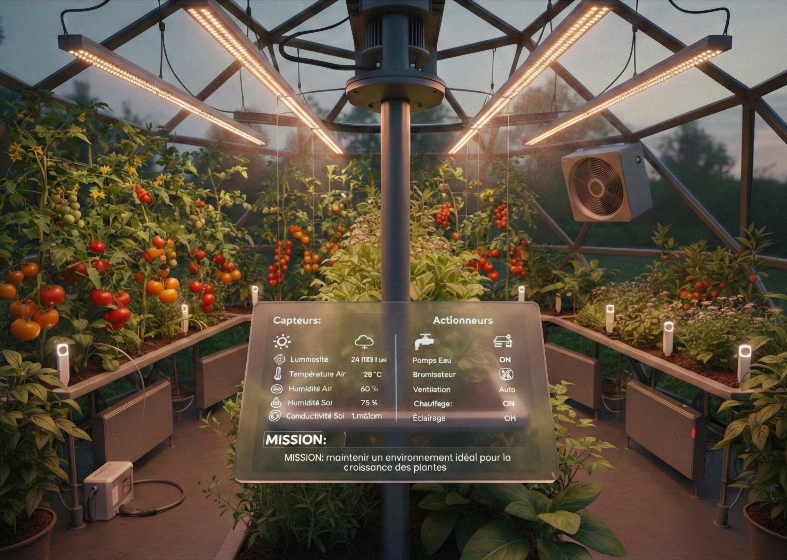
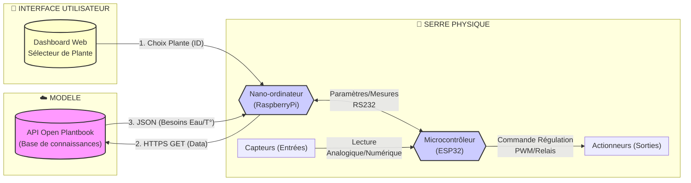
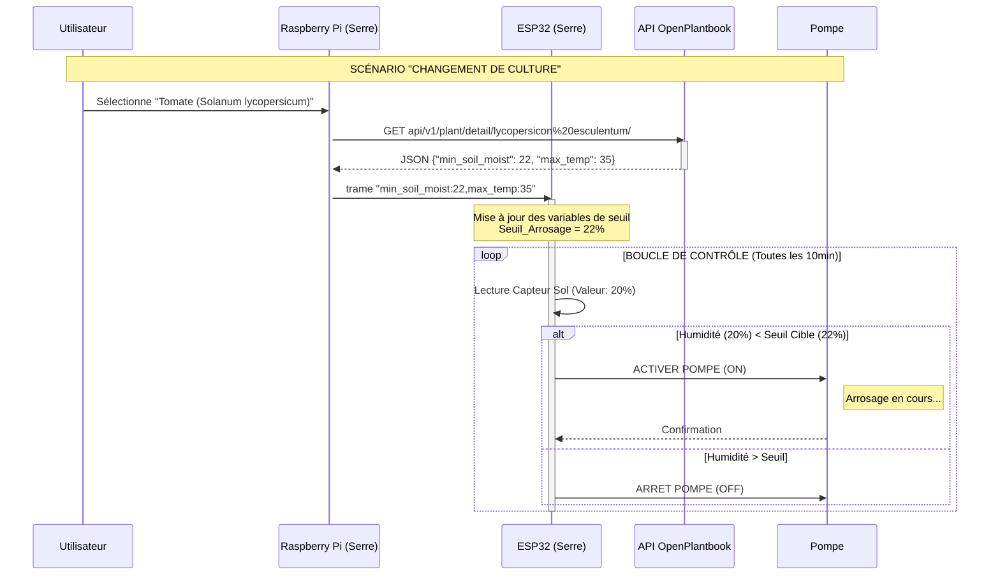

# 🌿 MINI PROJET 2026 : SERRE AUTONOME & ADAPTATIVE (AGRITECH)

## Présentation générale du système

### Contexte

Les agriculteurs d’aujourd’hui utilisent des serres où règnent des conditions optimales pour la culture des plantes.

> La culture sous serre s'appelle la **serriculture**. Une serre est une structure qui peut être parfaitement close destinée en général à la production agricole. Elle vise à soustraire aux éléments climatiques les cultures vivrières ou de loisir pour une meilleure gestion des besoins des plantes et pour en accélérer la croissance ou les produire indépendamment des saisons.
> La maîtrise du climat est la raison d'être des serres ; on peut créer un environnement idéal pour la croissance des plantes. Sa gestion est souvent confiée à un ordinateur surtout si les unités de production sont grandes.
> L’effet de serre permet de réunir des conditions hygrométriques et photopériodiques adaptées à la culture sous serres.

### Objectifs

L'agriculture de précision (Agritech) ne se contente plus d'automatiser l'arrosage : elle l'optimise biologiquement. Chaque plante possède des besoins spécifiques. Arroser un cactus comme une tomate est une aberration écologique et agronomique !

Le projet vise à concevoir une serre (ou un potager d'intérieur) capable de **s'auto-configurer** en fonction de la plante hébergée.

> Fondée en 2016, la [Ferme Digitale](https://www.lafermedigitale.fr/) fédère plus d’une cinquantaine de start-up et entreprises qui élaborent des solutions au service de l’agriculture et de l’alimentation. L’association a pour ambition de promouvoir l’innovation et le numérique pour une agriculture de précision « performante, durable, équitable et citoyenne ».

### Missions

Le système devra remplir les missions suivantes :

- La sélection de la culture
- Le paramétrage automatique des différents seuils (humidité, température, éclairement lumineux) en fonction de la culture sélectionnée
- La visualisation des états, données, seuils et des alarmes sur un tableau de bord (_dashboard_)
- Le pilotage des différents actionneurs suivant les seuils paramétrés

### Innovation : Le "_Smart Profiling_"

Contrairement aux systèmes classiques basés sur des seuils fixes (exemple : _"Si humidité < 30% alors arroser"_), ce système sera **dynamique et connecté**.

1.  **Sélection :** L'utilisateur indique sa culture (par exemple : "Basilic", "Orchidée", ...) via une interface web.
2.  **Traitement :** Le système interroge une **API externe** (_Open Plantbook_) pour récupérer les besoins vitaux de la plante.
3.  **Adaptation :** Le système paramètre automatiquement les seuils des capteurs (Sol, Air, Lumière) et des actionneurs sans intervention humaine.
4.  **Régulation :** Le système maintient un environnement idéal pour la croissance des plantes.

## Architecture générale

Le système est architecturé autour de deux unités centrales de traitement :

- [Raspberry Pi](https://fr.wikipedia.org/wiki/Raspberry_Pi) : un nano-ordinateur monocarte à processeur ARM
- [ESP32](https://fr.wikipedia.org/wiki/ESP32) : un microcontrôleur basé sur l'architecture Xtensa (double coeur) et microprocesseur LX de Tensilica

> Il faudra définir les capteurs et actionneurs équipant la serre.

## Scénario d'usage

Ce schéma illustre un exemple de la logique "Adaptative" :

## Ressources

L'équipe pourra s'appuyer sur les ressources techniques suivantes identifiées lors de l'avant-projet :

- **L'API indispensable :**
  - [Open Plantbook API](https://open.plantbook.io/) : Documentation officielle pour récupérer les données biologiques des plantes (_Token_ requis).
- **Tutoriels et exemples de réalisation :**
  - **Makery :** "[La serre connectée DIY venue du Japon](https://www.makery.info/2017/04/28/agriculture-la-serre-connectee-diy-venue-du-japon/)" (référence pour le design et l'approche open-source).
  - **Instructables :** "[Mini Serre Connectée](https://www.instructables.com/Tutorial-FR-Mini-Serre-Connect%C3%A9e/)" (Tutoriel technique pas à pas).
  - **Terra Potager :** "[Fabriquer une serre à semis autonome](https://terra-potager.com/tuto-fabriquer-une-serre-a-semis-quasi-autonome/)" (focus sur la gestion des semis).

Vidéo d'un projet de serre (BTS SN 2018 LaSalle Avignon) :

## Calendrier 2026

| Séance |              Date               |           Matière           | Activités                                                                                             |
| :----: | :-----------------------------: | :-------------------------: | :---------------------------------------------------------------------------------------------------- |
|   1    |   **17 mars** (8h - 10h)   |   **Sciences Physiques**    | [Présentation du projet](./README.md) [Étude du système](./activites/1-scp-etude-systeme.md)     |
|   2    |  **17 mars** (10h - 12h)   |      **Spécialité IR**      | [Mettre en oeuvre l'API Open Plantbook](./activites/1-ir-plantbook.md)                                |
|   3    |   **31 mars** (8h - 10h)   |   **Sciences Physiques**    | [Étude de la liaison série RS-232](./activites/2-scp-liaison-serie.md)                                |
|   4    |  **31 mars** (10h - 12h)   |      **Spécialité IR**      | [Mise en oeuvre de la liaison série RS-232 (Raspberry Pi - ESP32)](./activites/2-ir-liaison-serie.md) |
|   5    |  **28 avril** (8h - 10h)   |   **Sciences Physiques**    | [Étude d'un capteur I2C](./activites/3-scp-capteur-i2c.md)                                            |
|   6    |  **28 avril** (10h - 12h)  |      **Spécialité IR**      | [Mettre en oeuvre un capteur I2C](./activites/3-ir-mesures-capteur-i2c.md)                            |
|   7    |   **12 mai** (8h - 10h)    |   **Sciences Physiques**    | [Préparation de l'oral](./activites/4-scp-preparation-oral.md)                                        |
|   8    |   **12 mai** (10h - 12h)   |      **Spécialité IR**      | [Finalisation des applications](./activites/4-ir-finalisation.md)                                     |
|   9    | **12 mai** (13h30 - 17h10) | **Sciences Physiques + IR** | Oral de présentation Démonstration                                                               |
|   10   | **12 mai** (16h35 - 17h10) | **Sciences Physiques + IR** | Rangement du matériel Bilan                                                                      |

## Ordre de passage (oral)

La durée de l'oral est de **15 minutes** (10 minutes de présentation et 5 minutes de démonstration).

| Équipe | Noms  |    Horaire    |
| :----: | :---: | :-----------: |
|   1    |       | 13h35 - 13h50 |
|   2    |       | 13h55 - 14h10 |
|   3    |       | 14h15 - 14h30 |
|   4    |       | 14h35 - 14h50 |
|   5    |       | 14h55 - 15h10 |
|   6    |       | 15h20 - 15h35 |
|   7    |       | 15h40 - 15h55 |
|   8    |       | 16h00 - 16h15 |

---
BTS LaSalle Avignon 2026 - M. VAIRA & Mme DOAT
