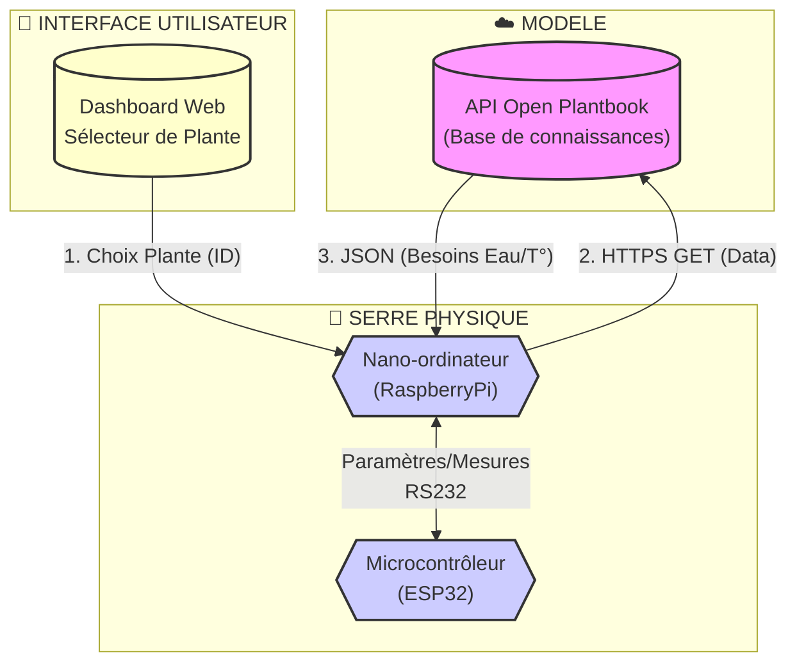
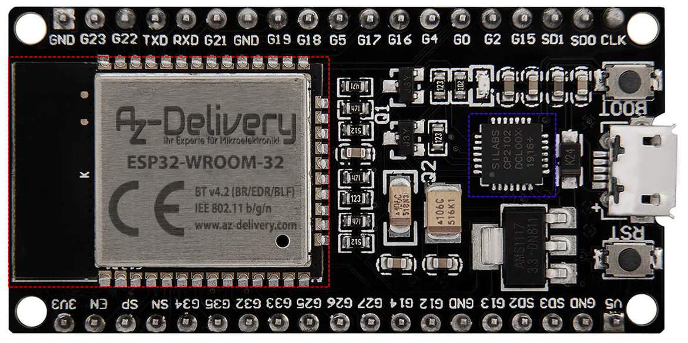
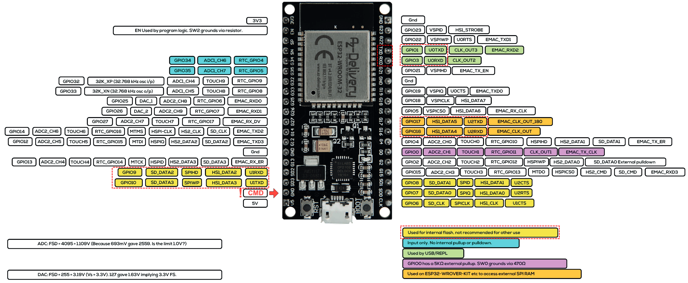
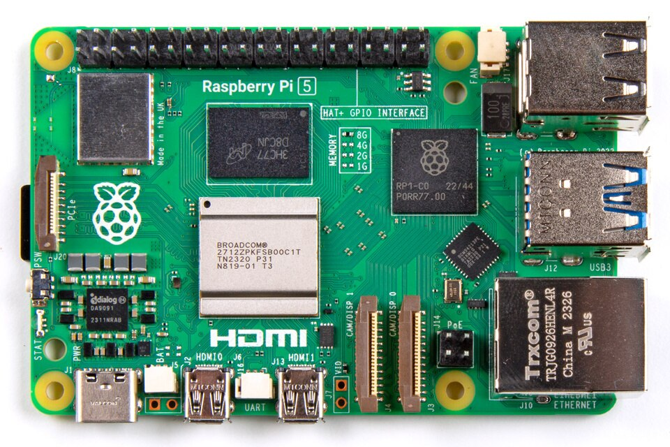
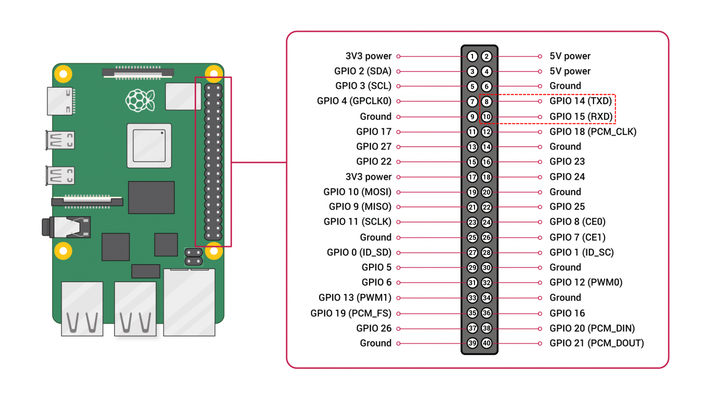
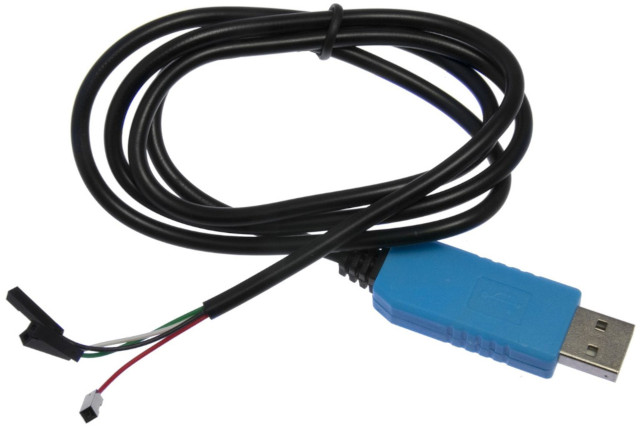
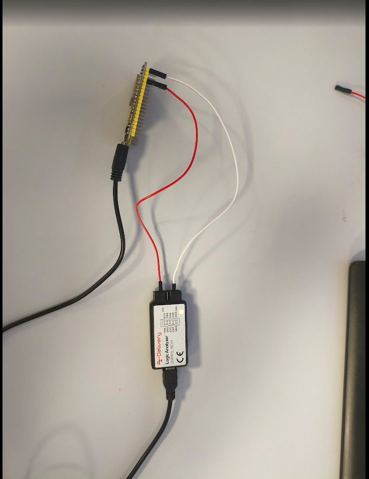
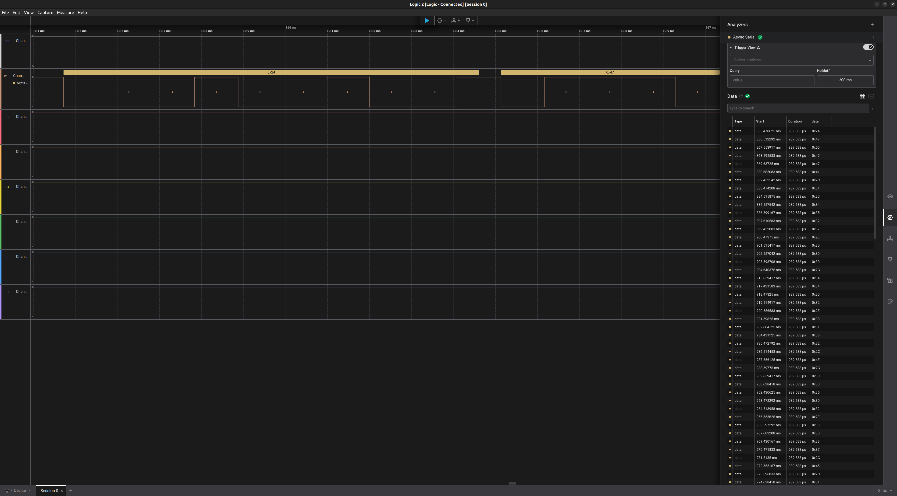

# 🌿 MINI PROJET 2026 : SERRE AUTONOME & ADAPTATIVE (AGRITECH)

## Activité n°2 (IR) : Mettre en oeuvre la liaison série

### Mise en situation

Le système doit maintenir un environnement idéal pour la croissance des plantes.

Le système est architecturé autour de deux unités centrales de traitement :

- [Raspberry Pi](https://fr.wikipedia.org/wiki/Raspberry_Pi) : un nano-ordinateur monocarte à processeur ARM
- [ESP32](https://fr.wikipedia.org/wiki/ESP32) : un microcontrôleur basé sur l'architecture Xtensa (double coeur) et microprocesseur LX de Tensilica

Missions du système :

- L'utilisateur indique sa culture via une interface web.

- Le **nano-ordinateur Raspberry Pi** interroge l'API _Open Plantbook_ pour récupérer les besoins vitaux de la plante.

- Le **nano-ordinateur Raspberry Pi** transmet les besoins vitaux de la plante au **microcontrôleur ESP32**

- Le **microcontrôleur ESP32** paramètre automatiquement les seuils des capteurs (Sol, Air, Lumière) et des actionneurs sans intervention humaine.

- Le **microcontrôleur ESP32** transmet périodiquement les mesures des capteurs (Sol, Air, Lumière) au **nano-ordinateur Raspberry Pi**.

Synoptique partiel du système :



### La liaison série RS-232

> Lire l'annexe [TRANSMISSION_DE_DONNEES.md](./annexes/TRANSMISSION_DE_DONNEES.md)

La liaison série mise en oeuvre entre [Raspberry Pi](https://fr.wikipedia.org/wiki/Raspberry_Pi) et l'[ESP32](https://fr.wikipedia.org/wiki/ESP32) est le standard [RS-232](https://fr.wikipedia.org/wiki/RS-232).

Le standard RS-232 permet une communication **série, asynchrone et duplex** entre les deux équipements sur trois fils minimum.

Les deux équipements en communication doivent absolument posséder les mêmes réglages (paramètres).

En pratique, il faut au moins configurer :

- le débit en bits/s et,
- le format de la trame RS-232.

Dans ce système, on utilisera :

- Les débits : 9600 bits/s (Raspberry Pi - ESP32) et 115200 bits/s (pour le moniteur série)
- Le format suivant :
  - 1 bit de départ (START)
  - 8 bit de données
  - pas de bit de parité
  - 1 bit d’arrêt (STOP)

### Protocole de communication

Le protocole de communication mis en oeuvre au niveau 2 (couche LIAISON) du modèle OSI sera orienté **caractères** (ASCII).

> Les protocoles orientés caractères nécessitent d’utiliser des délimiteurs codés en ASCII.

On utilise les délimiteurs :

- de début de trame : `$`
- de fin de trame `\r\n`
- de fin de champs : `;`

> Les champs sont les éléments constituant une trame. Cela peut être : le type de trame, une commande, une valeur etc.

Ici, il y a deux types de trame :

- la trame contenant les paramètres (obtenus à partir d'_Open Plantbook_) envoyée par le [Raspberry Pi](https://fr.wikipedia.org/wiki/Raspberry_Pi) vers l'[ESP32](https://fr.wikipedia.org/wiki/ESP32) :

| "max_light_mmol" | "min_light_mmol" | "max_light_lux" | "min_light_lux" | "max_temp" | "min_temp" | "max_env_humid" | "min_env_humid" | "max_soil_moist" | "min_soil_moist" | "max_soil_ec" | "min_soil_ec" |
| :--------------: | :--------------: | :-------------: | :-------------: | :--------: | :--------: | :-------------: | :-------------: | :--------------: | :--------------: | :-----------: | :-----------: |
|       7200       |       3000       |      75000      |      2800       |     35     |     5      |       80        |       30        |        60        |        15        |     2000      |      350      |

Exemple : `$7200;3000;75000;2800;35;5;80;30;60;15;2000;350;\r\n`

> Un champ peut être vide si aucun paramètre n'a été obtenu.

- la trame contenant les mesures (réalisée à partir des capteurs installés) envoyée par l'[ESP32](https://fr.wikipedia.org/wiki/ESP32) vers le [Raspberry Pi](https://fr.wikipedia.org/wiki/Raspberry_Pi) :

| "light_mmol" | "light_lux" | "temp" | "env_humid" | "soil_moist" | "soil_ec" |
| :----------: | :---------: | :----: | :---------: | :----------: | :-------: |
|              |    15000    |   28   |     56      |      60      |           |

Exemple : `$;15000;28;56;60;;\r\n`

> Un champ peut être vide si aucune mesure n'a été réalisée.

### ESP32

L'[AZ-Delivery Dev Kit C](https://www.az-delivery.de/fr/products/esp32-developmentboard) (ESP32 NODEMCU) a été conçu par [Espressif](https://www.espressif.com/) pour programmer le microcontrôleur [ESP32](https://www.espressif.com/en/products/socs/esp32). L'ESP32 utilisé possède une unité centrale composée de 2 cœurs Tensilica LX6 32 bits à 240 MHz.



L'ESP32 possède **trois interfaces UART** (`UART0`, `UART1` et `UART2`) :



> `U0*` pour le module `UART0`, `U1*` pour le module `UART1` et `U2*` pour le module `UART2`.
>
> Certains microcontrôleurs ont un nombre très restreint de broches, si bien qu'une broche (_pin_) peut correspondre à plusieurs périphériques internes. La fonction choisie doit alors être sélectionnée logiciellement.

Le _framework_ Arduino fournit une classe `HardwareSerial` pour gérer la liaison série :

- [HardwareSerial.h](https://github.com/espressif/arduino-esp32/blob/master/cores/esp32/HardwareSerial.h)
- [HardwareSerial.cpp](https://github.com/espressif/arduino-esp32/blob/master/cores/esp32/HardwareSerial.cpp)

et trois objets déjà définis globalement `Serial` (ou `Serial0`), `Serial1` et `Serial2`.

> cf. [Exemples](https://github.com/espressif/arduino-esp32/tree/master/libraries/ESP32/examples/Serial).

| UART  |      Nom (Arduino)      |   TX   |   RX   | Remarques                                                       |
| ----- | :---------------------: | :----: | :----: | --------------------------------------------------------------- |
| UART0 | `Serial` (ou `Serial0`) | GPIO1  | GPIO3  | définies par défaut par le chargeur de démarrage (_bootloader_) |
| UART1 |        `Serial1`        | GPIO10 | GPIO9  | pour l'accès en lecture/écriture de la mémoire Flash interne    |
| UART2 |        `Serial2`        | GPIO17 | GPIO16 | sur certains modèles, pour l'accès à une mémoire RAM externe    |

> [!CAUTION]
> L'UART1 est utilisé pour l'accès en lecture/écriture de la mémoire Flash interne. Il faut donc faire très attention ! Il est évidemment possible de changer l'affectation des broches GPIO.

- Exemple d'initialisation des ports séries avec `begin()` (cette fonction est toujours appelée depuis `setup()`) :

```cpp
#include <Arduino.h>

// Le port série 0 : moniteur
#define DEBIT_PORT_SERIE_0 115200
#define DEBIT_PORT_SERIE_1 9600
#define DEBIT_PORT_SERIE_2 9600

// Le port série 1
#define FORMAT_PORT_SERIE_1 SERIAL_8N1 // 8 bits, pas de parité et 1 bit de stop
#define BROCHE_PORT_SERIE_1_RX 4       // réaffectation de la broche RX du port série 1
#define BROCHE_PORT_SERIE_1_TX 5       // réaffectation de la broche TX du port série 1

void setup()
{
  // Initialise le port série 0
  Serial.begin(DEBIT_PORT_SERIE_0);

  // Initialise le port série 1 en précisant le débit, le format et les broches
  Serial1.begin(DEBIT_PORT_SERIE_1, FORMAT_PORT_SERIE_1, BROCHE_PORT_SERIE_1_RX, BROCHE_PORT_SERIE_1_TX);

  // Initialise le port série 2
  Serial2.begin(DEBIT_PORT_SERIE_2);
}

...
```

Les données reçues sur une liaison série ne sont jamais "lues" directement. Elles sont placées dans un _buffer_ (mémoire tampon FIFO) interne dont la taille est de 128 octets pour l'ESP32. La taille du _buffer_ peut être étendu logiciellement (ici 256 octets par défaut). Cette taille peut être modifiée avec `setRxBufferSize()`. Il existe d'autres fonctions de configuration comme `setTimeout()`.

Il y a deux techniques habituelles pour lire des données depuis une liaison :

- par scrutation (_polling_) : on interroge régulièrement (périodiquement) la présence de données dans le _buffer_ avec `available()` puis on les "lit" avec `read()` qui les retire du _buffer_. On peut aussi utiliser `peek()` qui retourne une donnée reçue sans la prélever du _buffer_.

> [!TIP]
> Le _framework_ Arduino fournit aussi `readBytes()` et `readString()` et surtout `readBytesUntil()` et `readStringUntil()` qui permettent de préciser un caractère "délimiteur" (très pratique dans les protocoles orientés caractères ASCII).

- par interruption : lorsqu'une donnée (ou plusieurs) est reçue, cela déclenche l'appel d'une fonction _callback_ pour les lire. On installe la fonction de rappel (_callback_) avec `onReceive()`.

> [!NOTE]
> Une [fonction de rappel](https://github.com/bts-lasalle-avignon-ressources/callback) (_callback_) est une fonction qui est passée en argument à une autre fonction. Cette dernière peut alors faire usage de cette fonction de rappel comme de n'importe quelle autre fonction, alors qu'elle ne la connaît pas par avance. (Wikipédia)

L'écriture de données sur une liaison série est souvent plus simple. Il suffit d'appeler `write()` ! Attention tout de même, le principe du _buffer_ est le même que pour le lecture : les données ne sont jamais envoyées directement. Elles sont placées dans un _buffer_ (mémoire tampon FIFO) interne dont la taille est de 128 octets pour l'ESP32. On peut appeler la fonction `availableForWrite()` qui retourne un booléen indiquant s'il est possible d'"écrire" sur le port.

> [!NOTE]
> La fonction `flush()` permet de "vider" les _buffers_ associés à la lecture et l'écriture.

- Exemple de lecture et écriture sur un port série (mode _echo_) :

```cpp
...

void loop()
{
  while (Serial1.available() > 0)
  {
    uint8_t octetLu = Serial1.read();
    Serial1.write(octetLu);
  }
}
```

> [!NOTE]
> Le port peut être fermé avec `end()` mais on l'utilise très peu car les programmes s'exécutant sur un système embarqué n'ont pas vocation à s'arrêter.

### Raspberry Pi

Le [Raspberry Pi](https://fr.wikipedia.org/wiki/Raspberry_Pi) est un nano-ordinateur monocarte à processeur ARM. Il dispose 17 × GPIO, UART, bus I²C, bus SPI et plusieurs ports USB.



Il y a deux manières d'assurer une communication série avec un Raspberry Pi en utilisant :

- un [adaptateur RS232 TTL / USB](./annexes/Adaptateur-USB-RS232.md)

> Le port série virtuel est alors accessible par le fichier de périphérique `/dev/ttyUSB*` où `*` est le numéro de port.

- l’interface UART disponible via les broches GPIO 14 (TX) et GPIO 15 (RX)



> La configuration et l'utilisation de l'interface UART dépend du modèle de Raspberry Pi : [Configure UARTs](https://www.raspberrypi.com/documentation/computers/configuration.html#configure-uarts). Dans ce mini-projet, on utilisera un [adaptateur RS232 TTL / USB](./annexes/Adaptateur-USB-RS232.md).

Les fichiers de périphérique pour les ports séries sous GNU/Linux (`*` correspond au numéro du port série au moment de sa détection):

- `/dev/ttyUSB*` : pour les [adaptateurs RS232 TTL / USB](./annexes/Adaptateur-USB-RS232.md)
- `/dev/ttyACM*` : pour les modems (et aussi carte Arduino, tablette Android, etc.)
- `/dev/ttyS*` : pour les ports séries intégrés

> La programmation d'une communication via un port série peut s'implémenter dans différents langages comme le C/C++, Python, etc.

Ici, on utilisera le langage Python avec la bibliothèque [pyserial](https://www.pyserial.com/docs) :

```sh
$ pip install pyserial
```

Il est possible de lister les ports séries disponibles :

```python
import serial.tools.list_ports

ports = serial.tools.list_ports.comports()
for port in ports:
    print(f"{port.device}: {port.description}")
```

Exemple basique :

```python
import serial

try:
    # Ouvrir le port série
    port_serie = serial.Serial('/dev/ttyUSB0', 9600, timeout=1)
    # Envoyer des données
    port_serie.write(b'Hello Serial World!\n')
    # Lire des données
    reponse = port_serie.readline()
    print(reponse.decode('utf-8').strip())
except serial.SerialException as e:
    print(f"Erreur : {e}")
except PermissionError:
    print("Accès refusé !")
except FileNotFoundError:
    print("Port non trouvé !")
finally:
    if 'port_serie' in locals() and port_serie.is_open:
        # Fermer le port
        port_serie.close()
```

> Le paramètre `baudrate` (de type `int`) correspond au débit en bits/s et  peut prendre les valeurs suivantes : 50, 75, 110, 134, 150, 200, 300, 600, 1200, 1800, 2400, 4800, 9600 (par défaut), 19200, 38400, 57600, 115200.

Documentations :

- [Configuration Guide](https://www.pyserial.com/docs/configuration)
- [Reading Serial Data](https://www.pyserial.com/docs/reading-data)
- [Writing Serial Data](https://www.pyserial.com/docs/writing-data)

### Travail demandé

Il faut commencer par valider une communication bidirectionnelle via un port série entre le [Raspberry Pi](https://fr.wikipedia.org/wiki/Raspberry_Pi) et l'[ESP32](https://fr.wikipedia.org/wiki/ESP32) puis implémenter les missions du système.

Pour le système, on utilisera la configuration suivante des ports séries :

| UART  |      Nom (Arduino)      |  TX   |  RX   | Configuration                                    |   Relié sur    |
| ----- | :---------------------: | :---: | :---: | ------------------------------------------------ | :------------: |
| UART0 | `Serial` (ou `Serial0`) | GPIO1 | GPIO3 | 115200 bits/s, 8 bits, pas parité, 1 bit de stop | moniteur série |
| UART1 |        `Serial1`        | GPIO5 | GPIO4 | 9600 bits/s, 8 bits, pas parité, 1 bit de stop   |  Raspberry Pi  |

On reliera donc le port série n°1 (`Serial1`) au PC via un [adaptateur RS232 TTL / USB](./annexes/Adaptateur-USB-RS232.md) :



> Lire l'annexe [Adaptateur-USB-RS232.md](./annexes/Adaptateur-USB-RS232.md)

Avec un [adaptateur RS232 TTL / USB](./annexes/Adaptateur-USB-RS232.md), il faut effectuer le cablage suivant :

| Couleur | Fonction | Fonction |   ESP32   |
| :-----: | :------: | :------: | :-------: |
|  Rouge  |   VCC    |          | Non relié |
|  Blanc  |    RX    |    TX    |   GPIO5   |
|  Vert   |    TX    |    RX    |   GPIO4   |
|  Noir   |   GND    |   GND    |    GND    |

> L'[adaptateur RS232 TTL / USB](./annexes/Adaptateur-USB-RS232.md) peut être branché sur un PC ou Raspberry Pi.
>
> ⚠️ Rappel : ne SURTOUT pas relier le VCC (fil rouge) de l'[adaptateur RS232 TTL / USB](./annexes/Adaptateur-USB-RS232.md) sur une broche de l'ESP32.

Pré-requis :

- Vérifier la détection de l'[adaptateur RS232 TTL / USB](./annexes/Adaptateur-USB-RS232.md) (commandes `dmesg` et `lsusb`) et les droits d'accès au fichier de périphérique (commande `ls -l`)

commande dmesg:

```bash
btssn1@cv-pc-b20-04:~/tp_github/mini-projet-2026-serre-autonome-adaptative-t8$ dmesg


[10725.071812] usb 1-3: new high-speed USB device number 12 using xhci_hcd
[10726.035868] usb 1-3: device descriptor read/64, error -71
[10726.292042] usb 1-3: New USB device found, idVendor=0925, idProduct=3881, bcdDevice= 0.01
[10726.292054] usb 1-3: New USB device strings: Mfr=0, Product=0, SerialNumber=0
[10726.337203] [UFW BLOCK] IN=eno1 OUT= MAC=d8:bb:c1:55:31:fe:00:fd:45:76:4f:c5:08:00 SRC=192.168.49.202 DST=192.168.55.4 LEN=276 TOS=0x00 PREC=0x00 TTL=64 ID=49298 PROTO=UDP SPT=161 DPT=51435 LEN=256 
[10726.339849] [UFW BLOCK] IN=eno1 OUT= MAC=d8:bb:c1:55:31:fe:9c:ae:d3:af:12:dc:08:00 SRC=192.168.50.3 DST=192.168.55.4 LEN=176 TOS=0x00 PREC=0x00 TTL=64 ID=6905 DF PROTO=UDP SPT=161 DPT=51435 LEN=156 
[10726.411855] usb 1-3: USB disconnect, device number 12
[10728.199832] usb 1-3: new high-speed USB device number 13 using xhci_hcd
[10728.352752] usb 1-3: New USB device found, idVendor=0925, idProduct=3881, bcdDevice= 0.00
[10728.352764] usb 1-3: New USB device strings: Mfr=1, Product=2, SerialNumber=0
[10728.352770] usb 1-3: Product: Logic
[10728.352774] usb 1-3: Manufacturer: Saleae LLC
[10729.863152] usb 1-3: USB disconnect, device number 13
[10730.179808] usb 1-3: new high-speed USB device number 14 using xhci_hcd
[10730.328610] usb 1-3: New USB device found, idVendor=0925, idProduct=3881, bcdDevice= 0.00
[10730.328622] usb 1-3: New USB device strings: Mfr=1, Product=2, SerialNumber=0
[10730.328628] usb 1-3: Product: Logic
[10730.328632] usb 1-3: Manufacturer: Saleae LLC
[10736.234823] usb 1-3: USB disconnect, device number 14
[10736.543752] usb 1-3: new high-speed USB device number 15 using xhci_hcd
[10736.951727] usb 1-3: device descriptor read/64, error -71
[10738.023793] usb 1-3: device descriptor read/64, error -71
[10738.263773] usb 1-3: new high-speed USB device number 16 using xhci_hcd
[10738.412693] usb 1-3: New USB device found, idVendor=0925, idProduct=3881, bcdDevice= 0.00
[10738.412705] usb 1-3: New USB device strings: Mfr=1, Product=2, SerialNumber=0
[10738.412710] usb 1-3: Product: Logic
[10738.412714] usb 1-3: Manufacturer: Saleae LLC
[10739.415916] usb 1-3: USB disconnect, device number 16
[10739.727772] usb 1-3: new high-speed USB device number 17 using xhci_hcd
[10739.876435] usb 1-3: New USB device found, idVendor=0925, idProduct=3881, bcdDevice= 0.00
[10739.876441] usb 1-3: New USB device strings: Mfr=1, Product=2, SerialNumber=0
[10739.876443] usb 1-3: Product: Logic
[10739.876445] usb 1-3: Manufacturer: Saleae LLC
[10740.147735] usb 1-5: new full-speed USB device number 18 using xhci_hcd
[10740.330889] usb 1-5: New USB device found, idVendor=10c4, idProduct=ea60, bcdDevice= 1.00
[10740.330901] usb 1-5: New USB device strings: Mfr=1, Product=2, SerialNumber=3
[10740.330907] usb 1-5: Product: CP2102 USB to UART Bridge Controller
[10740.330911] usb 1-5: Manufacturer: Silicon Labs
[10740.330915] usb 1-5: SerialNumber: 0001
[10740.339748] cp210x 1-5:1.0: cp210x converter detected
[10740.340624] usb 1-5: cp210x converter now attached to ttyUSB0

```


Commande lsubs:

```bash
btssn1@cv-pc-b20-04:~/tp_github/mini-projet-2026-serre-autonome-adaptative-t8$ lsusb
Bus 001 Device 005: ID 10c4:ea60 Silicon Labs CP210x UART Bridge
Bus 001 Device 007: ID 0925:3881 Lakeview Research Saleae Logic
```

Commande ls -l:

```bash

btssn1@cv-pc-b20-04:~/tp_github/mini-projet-2026-serre-autonome-adaptative-t8/activites/src/2-rs232$ ls -l
total 12
drwxrwxr-x 7 btssn1 btssn1 4096 mars  31 11:40 esp32-serial
-rw-rw-r-- 1 btssn1 btssn1  180 mars  17 10:24 liste_ports.py
-rwxrwxr-x 1 btssn1 btssn1 1023 avril 28 15:09 rs232.py

```


- Identifier le fichier de périphérique associé à la carte ESP32 et adapter le fichier [src/2-rs232/esp32-serial/platformio.ini](./src/2-rs232/esp32-serial/platformio.ini) si besoin (les champs `upload_port` et `monitor_port`)
- Lister les ports disponibles avec le script [src/2-rs232/liste_ports.py](./src/2-rs232/liste_ports.py)

```bash

btssn1@cv-pc-b20-04:~/tp_github/mini-projet-2026-serre-autonome-adaptative-t8/activites/src/2-rs232$ python3 ./liste_ports.py 
/dev/ttyS0: ttyS0
/dev/ttyUSB0: USB-Serial Controller D

```


1. Réaliser le cablage de la liaison entre les deux équipements.

  


2. Valider un échange bidirectionnel entre les deux équipements avec les codes sources fournis :

- Raspberry Pi : [src/2-rs232/rs232.py](./src/2-rs232/rs232.py)
- ESP32 : [src/2-rs232/esp32-serial/src/main.cpp](./src/2-rs232/esp32-serial/src/main.cpp) (Projet [PlatformIO](./annexes/PlatformIO.md))


Voici la trame envoyé : 

  

Voici le texte envoyé :

  

3. Modifier les codes sources fournis pour valider un échange en respectant le protocole de communication à implémenter dans ce système.

:warning: Vous pourrez terminer ce travail dans l'activité n°4 : [Finalisation des applications](./4-ir-finalisation.md)

Côté Raspberry Pi :

- Intégrer la récupération des paramètres via _Open Plantbook_ (cf. [activité n°1](./1-ir-plantbook.md))
- Extraire les paramètres de la réponse JSON (cf. [JSON encoder and decoder](https://docs.python.org/fr/3.14/library/json.html))
- Fabriquer et envoyer la trame (cf. [Protocole de communication](#protocole-de-communication))
- Réceptionner continuellement les mesures (cf. le mode _Continuous Reading_ décrit dans la documenation [Reading Serial Data with PySerial](https://www.pyserial.com/docs/reading-data))

Côté ESP32 :

- La réception des paramètres devra se faire par interruption (cf. `onReceive()`)
- L'émission des mesures devra se faire périodiquement (cf. `millis()`)

Mode simulation : (définir une étiquette `MODE_SIMULATION`)

- Période pour l'envoi des mesures : 30 secondes (c'est une constante !)
- Les mesures peuvent être simulées par un générateur pseudo-aléatoire (cf. `randomSeed()` et `random()`)

---
BTS LaSalle Avignon 2026
