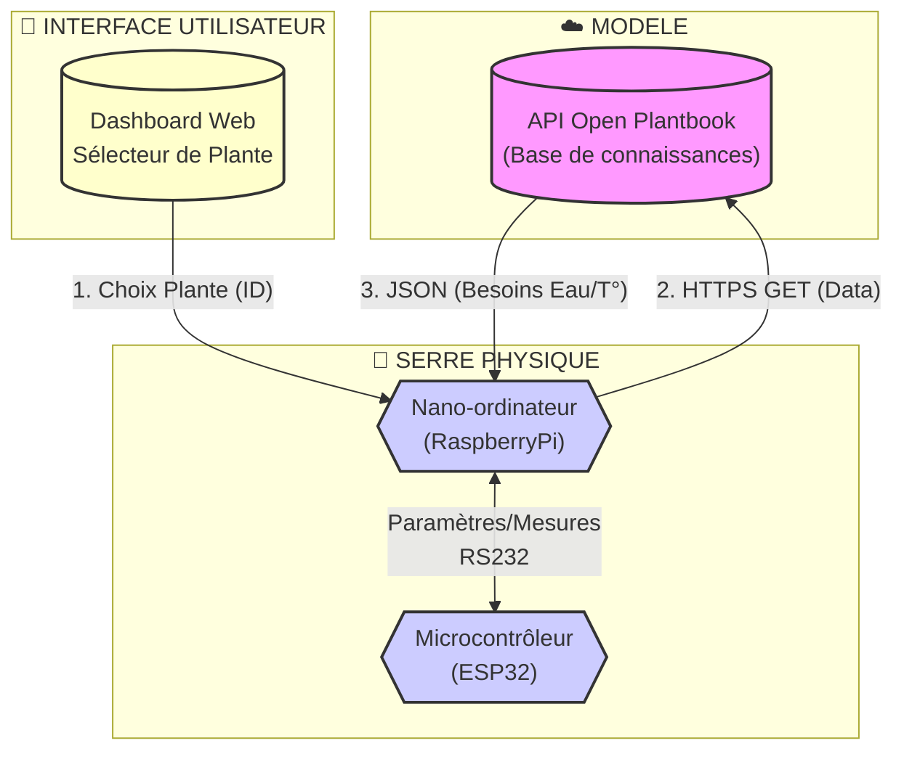

# 🌿 MINI PROJET 2026 : SERRE AUTONOME & ADAPTATIVE (AGRITECH)

## Activité n°2 (Sciences Physiques) : Étude de la liaison série

### Mise en situation

Rappel : Le système doit maintenir un environnement idéal pour la croissance des plantes.

Le système est architecturé autour de deux unités centrales de traitement :

- [Raspberry Pi](https://fr.wikipedia.org/wiki/Raspberry_Pi) : un nano-ordinateur monocarte à processeur ARM
- [ESP32](https://fr.wikipedia.org/wiki/ESP32) : un microcontrôleur basé sur l'architecture Xtensa (double coeur) et microprocesseur LX de Tensilica

Missions du système :

- L'utilisateur indique sa culture via une interface web.

- Le nano-ordinateur Raspberry Pi interroge l'API _Open Plantbook_ pour récupérer les besoins vitaux de la plante.

- Le **nano-ordinateur Raspberry Pi** transmet les besoins vitaux de la plante au **microcontrôleur ESP32**

- Le microcontrôleur ESP32 paramètre automatiquement les seuils des capteurs (Sol, Air, Lumière) et des actionneurs sans intervention humaine.

- Le microcontrôleur ESP32 lit périodiquement les capteurs (Sol, Air, Lumière).

- Le **microcontrôleur ESP32** transmet périodiquement les mesures relevées au **nano-ordinateur Raspberry Pi**.

Synoptique partiel du système :

### TD : Étude de la transmission des données

:warning: Le document à rédiger est dans _Google Classroom_.

> Annexe : [TRANSMISSION_DE_DONNEES.md](./annexes/TRANSMISSION_DE_DONNEES.md)

1. Justifier le choix actuel de la liaison RS-232 en comparant avec d’autres liaisons séries.

2. En utilisant une liaison RS-232, quelle est la distance maximale de la liaison entre le nano-ordinateur Raspberry Pi et le microcontrôleur ESP32 ?

3. Avec une transmission série configurée en 9600 bits/s, 1 bit de start, 8 bits de données, 1 bit de stop, aucune parité, combien de bits sont nécessaires à la transmission d’un octet ?

4. Quelle est alors la durée de transmission d’un octet ?

5. Calculer le temps de transmission ASCII de la trame suivante : `$22000;5200;130000;4000;35;10;70;30;70;22;2500;350;\r\n`

6. Quel est le rôle du bit de START ?

7. Quel est le rôle du bit de parité ?

8. Sur la transmission de l’octet `0xFF`, quelle est la valeur de ce bit de parité ?

9. Quels sont les avantages et inconvénients (au moins un) d'utiliser une trame au format ASCII ?

10. Justifier le choix de la liaison RS-485 en comparant avec d’autres liaisons séries.

### TP : Capturer des trames

> Annexe : [Analyseur-Logique-saleae.md](./annexes/Analyseur-Logique-saleae.md)

1. Relever les trames séries transmises entre le nano-ordinateur Raspberry Pi et le microcontrôleur ESP32 avec l'analyseur logique saleae. Placer vos captures dans le dossier [activites/captures/](./captures/).

Exemple de capture :

2. Mesurer le temps de transmission d'une trame série asynchrone.

---
BTS LaSalle Avignon 2026
