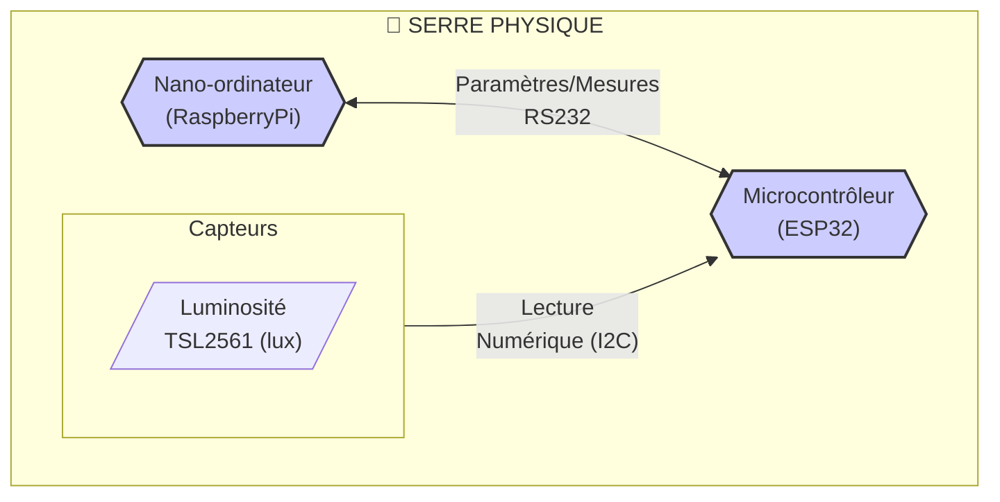
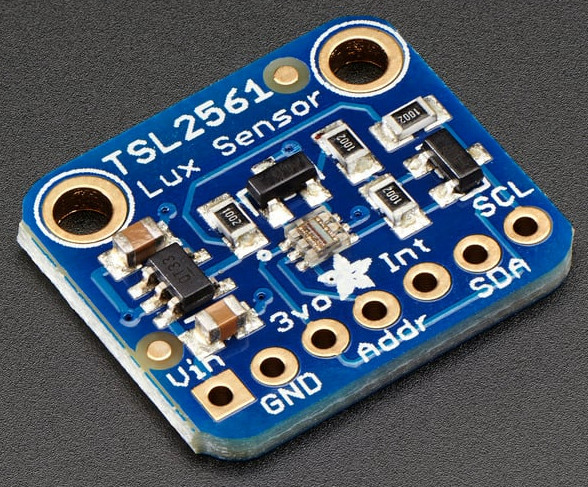
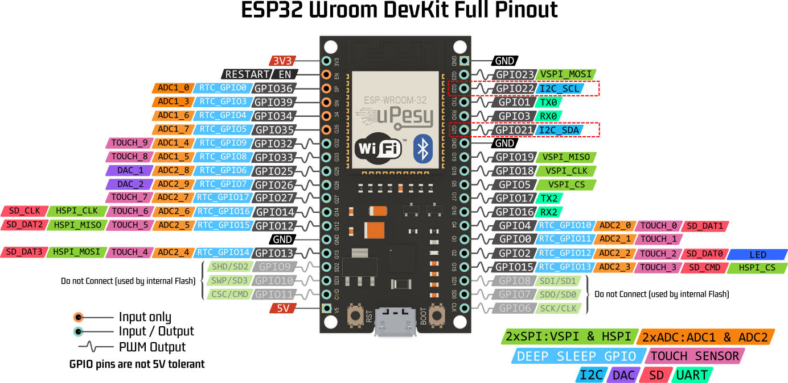
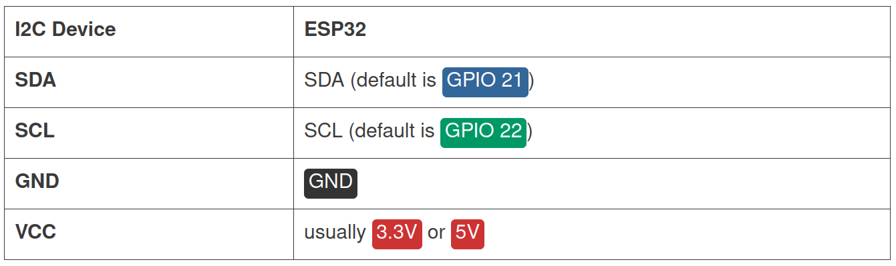
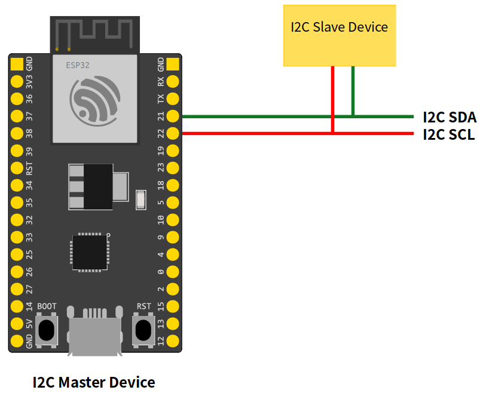

# 🌿 MINI PROJET 2026 : SERRE AUTONOME & ADAPTATIVE (AGRITECH)

## Activité n°3 (IR) : Mettre en oeuvre un capteur I2C

### Mise en situation

Rappel : Le système doit maintenir un environnement idéal pour la croissance des plantes.

Le système est architecturé autour de deux unités centrales de traitement :

- [Raspberry Pi](https://fr.wikipedia.org/wiki/Raspberry_Pi) : un nano-ordinateur monocarte à processeur ARM
- [ESP32](https://fr.wikipedia.org/wiki/ESP32) : un microcontrôleur basé sur l'architecture Xtensa (double coeur) et microprocesseur LX de Tensilica

Missions du système :

- Le nano-ordinateur Raspberry Pi transmet les besoins vitaux de la plante au microcontrôleur ESP32

- Le microcontrôleur ESP32 paramètre automatiquement les seuils des capteurs (Sol, Air, Lumière) et des actionneurs sans intervention humaine.

- Le **microcontrôleur ESP32 lit périodiquement les différents capteurs** (Sol, Air, **Lumière**, etc.).

- Le microcontrôleur ESP32 transmet périodiquement les mesures relevées au nano-ordinateur Raspberry Pi.

Synoptique partiel du système :



### Travail demandé

Ressources :

- [MICROCONTROLEUR.md](./annexes/MICROCONTROLEUR.md)
- [PlatformIO.md](./annexes/PlatformIO.md)
- [CAPTEUR.md](./annexes/CAPTEUR.md)
- [TRANSMISSION_DE_DONNEES.md](./annexes/TRANSMISSION_DE_DONNEES.md) et [BUS-I2C.md](./annexes/BUS-I2C.md)

La mise en oeuvre porte sur le capteur de luminosité TSL2561 (I2C)



> _Datasheet_ : [TSL2561.pdf](./datasheets/TSL2561.pdf)

Il faut commencer par valider une détection du circuit I2C TSL2561 puis une communication permettant la lecture de la luminosité.

Le bus I2C sur un ESP32 :





Pour ce circuit, il faut donc effectuer le cablage suivant :



> Il faut aussi relier GND.

1. Écrire dans [src/3-i2c/esp32-scan-i2c/src/main.cpp](./src/3-i2c/esp32-scan-i2c/src/main.cpp) la fonction `void scanI2C()` qui permet de détecter les adresses I2C présentes sur le bus en parcourant les 127 périphériques possibles (de `0x01` à `0x7f`) en utilisant les fonctions :

- [Wire.begin()](https://docs.arduino.cc/language-reference/en/functions/communication/wire/begin/)
- [Wire.beginTransmission()](https://docs.arduino.cc/language-reference/en/functions/communication/wire/beginTransmission/)
- [Wire.endTransmission()](https://docs.arduino.cc/language-reference/en/functions/communication/wire/endTransmission/) (cette fonction retourne `0` en cas de succès)

```bash

Scan du bus I2C en cours
0x39 ok
Scan du bus I2C en cours
0x39 ok
```


> L'adresse `0x00` est une adresse de _broadcast_. Les adresses détectées seront affichées en hexadécimal, par exemple : `Serial.printf("0x%02X ok\n", adresse);`

2. Écrire un programme dans [src/3-i2c/esp32-tsl2561/src/main.cpp](./src/3-i2c/esp32-tsl2561/src/main.cpp) pour mesurer périodiquement la luminosité en lux ($lx$) en utilisant le capteur [TSL2561.pdf](./datasheets/TSL2561.pdf).

---
BTS LaSalle Avignon 2026
