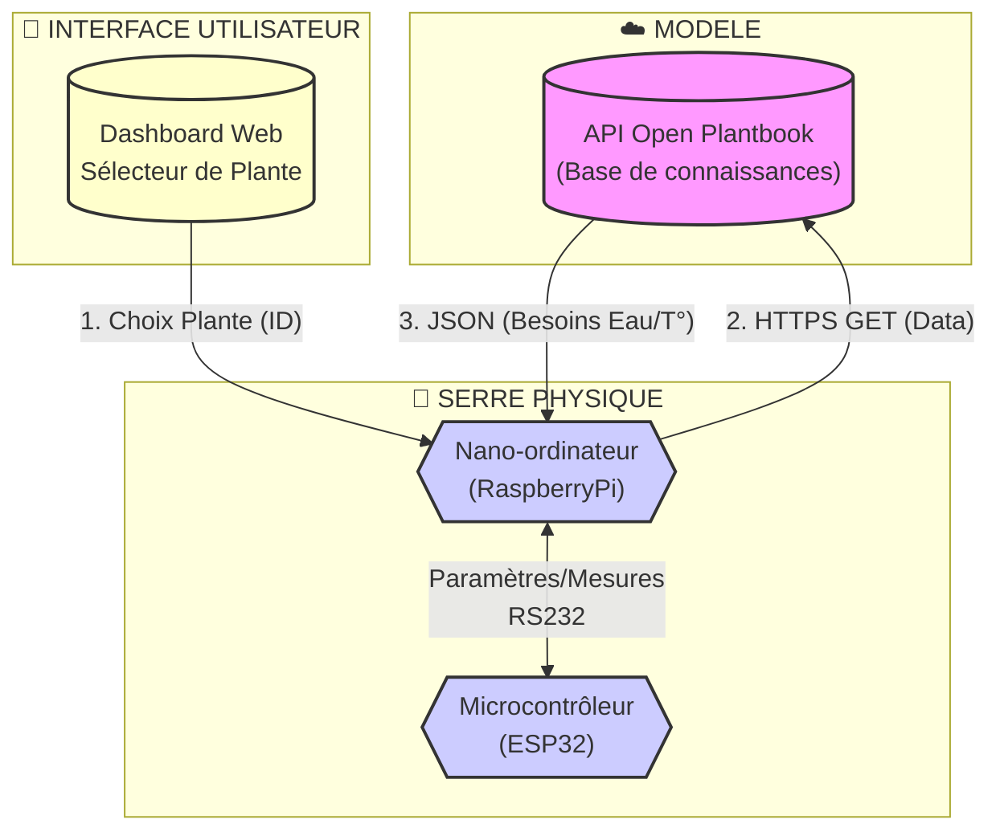
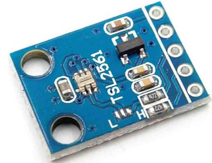
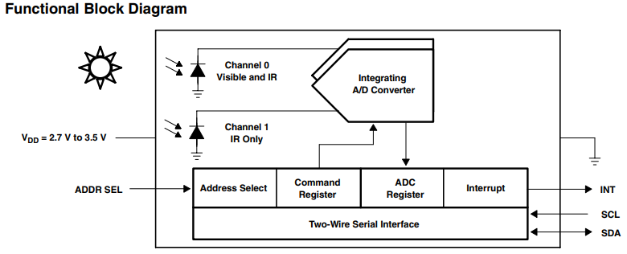
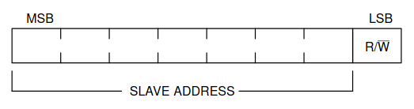
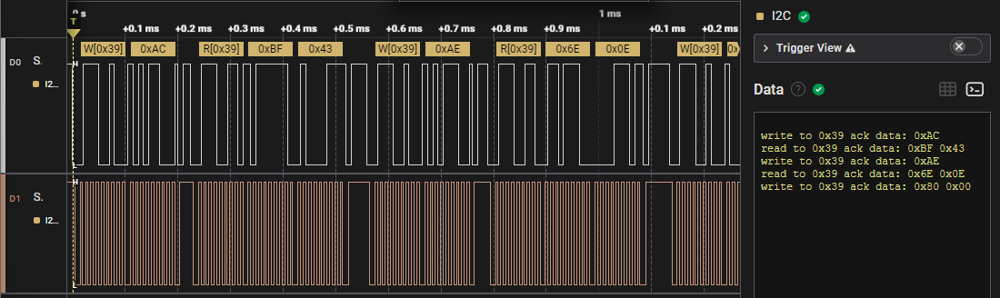
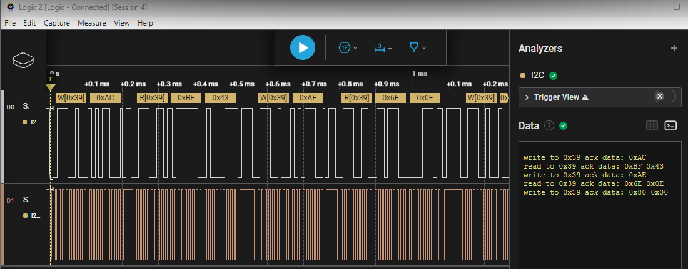

# 🌿 MINI PROJET 2026 : SERRE AUTONOME & ADAPTATIVE (AGRITECH)

## Activité n°3 (Sciences Physiques) : Étude d'un capteur I2C

### Mise en situation

Rappel : Le système doit maintenir un environnement idéal pour la croissance des plantes.

Le système est architecturé autour de deux unités centrales de traitement :

- [Raspberry Pi](https://fr.wikipedia.org/wiki/Raspberry_Pi) : un nano-ordinateur monocarte à processeur ARM
- [ESP32](https://fr.wikipedia.org/wiki/ESP32) : un microcontrôleur basé sur l'architecture Xtensa (double coeur) et microprocesseur LX de Tensilica

Missions du système :

- L'utilisateur indique sa culture via une interface web.

- Le nano-ordinateur Raspberry Pi interroge l'API _Open Plantbook_ pour récupérer les besoins vitaux de la plante.

- Le nano-ordinateur Raspberry Pi transmet les besoins vitaux de la plante au microcontrôleur ESP32

- Le microcontrôleur ESP32 paramètre automatiquement les seuils des capteurs (Sol, Air, Lumière) et des actionneurs sans intervention humaine.

- Le **microcontrôleur ESP32 lit périodiquement les capteurs** (Sol, Air, Lumière).

- Le microcontrôleur ESP32 transmet périodiquement les mesures relevées au nano-ordinateur Raspberry Pi.

Synoptique partiel du système :



### TD : Mesure de luminosité avec le TSL2561

:warning: Le document à rédiger est dans _Google Classroom_.

> Annexes : [BUS-I2C.md](./annexes/BUS-I2C.md)



_Datasheet_ : [TSL2561.pdf](./datasheets/TSL2561.pdf)

Le diagramme bloc ci-dessous montre le concept de la mesure de luminosité. Après avoir mesuré la lumière visible et infrarouge sur le _channel_ `0` et seulement l'infrarouge sur le _channel_ `1`, ces valeurs sont numérisées via un ADC pour être sauvegardées dans des registres.



> Ces registres seront accessibles via le bus I2C.

1. Quel est le rôle des lignes SDA et SCL ?

2. Quelle est, en binaire/hexadécimal, l’adresse I2C sur 7 bits du TSL2561 (page 10 du _datasheet_ [TSL2561.pdf](./datasheets/TSL2561.pdf)) ?

Adresse esclave (_SLAVE ADDRESS_) :

| binaire | hexadécimal |
| :-----: | :---------: |
|         |             |
|         |             |
|         |             |

3. À quelles "adresses" sur 8 bits cela correspond-il selon qu’on lit ou écrit sur le capteur I2C ?



|             | lecture | écriture |
| :---------: | :-----: | :------: |
|   binaire   |         |          |
| hexadécimal |         |          |

4. À quelle fréquence maximale peut-on dialoguer en I2C avec le TSL2561 ?

5. À quel mode (_standard_, _fast_, _fast+_, _high speed_, _ultra fast_) cela correspond-il ?

6. Donner en hexadécimal les valeurs des codes commandes (page 19 du _datasheet_ [TSL2561.pdf](./datasheets/TSL2561.pdf)) pour les canaux de conversion (_channel_ `0` et _channel_ `1`) ?

- _channel_ `0` : 
- _channel_ `1` : 

On a relevé les trames suivantes :



Dans cet exemple de capture, les octets lus sont :

- _channel_ `0` : `0xBF` (_DataLow_) et `0x43` (_DataHigh_)
- _channel_ `1` : `0x6E` (_DataLow_) et `0x0E` (_DataHigh_)

> 📝 Les données sont transmises sur deux octets avec le LSB (_DataLow_) suivi du MSB (_DataHigh_).

7. Donner en hexadécimal puis en décimal les valeurs des canaux de conversion (_channel_ `0` et _channel_ `1`) ?

Calcul des valeurs :

```txt
Channel0 = 256 * DataHigh + DataLow
Channel1 = 256 * DataHigh + DataLow
```

- _channel_ `0` : 
- _channel_ `1` : 

Le calcul de la luminosité (page 23 du _datasheet_ [TSL2561.pdf](./datasheets/TSL2561.pdf)) dépend du rapport entre les deux canaux. Le tableau ci-dessous indique la formule à choisir :

|                  Intervalle                  |                                   Formule                                   |
| :------------------------------------------: | :-------------------------------------------------------------------------: |
|  Pour $0 < \frac{CH1}{CH0} \leqslant 0.50$   | $Lux = 0.0304 \times CH0 − 0.062 \times CH0 \times (\frac{CH1}{CH0})^{1.4}$ |
| Pour $0.50 < \frac{CH1}{CH0} \leqslant 0.61$ |                $Lux = 0.0224 \times CH0 − 0.031 \times CH1$                 |
| Pour $0.61 < \frac{CH1}{CH0} \leqslant 0.80$ |                $Lux = 0.0128 \times CH0 − 0.0153 \times CH1$                |
| Pour $0.80 < \frac{CH1}{CH0} \leqslant 1.30$ |               $Lux = 0.00146 \times CH0 − 0.00112 \times CH1$               |
|        Pour $\frac{CH1}{CH0} > 1.30$         |                                  $Lux = 0$                                  |

> :warning: Le boîtier du capteur est le modèle T dans notre cas.

8. À partir des valeurs précédentes, calculer la valeur en _lux_ de la luminosité.

- _channel_ `0` : 
- _channel_ `1` : 

Rapport entre les deux canaux : 

On utilise la formule suivante : 

Valeur en _lux_ de la luminosité :

### TP : Capturer des trames

> Annexe : [Analyseur-Logique-saleae.md](./annexes/Analyseur-Logique-saleae.md)

1. Relever un échange I2C entre un capteur et le microcontrôleur ESP32 avec l'analyseur logique saleae. Placer vos captures dans le dossier [activites/captures/](./captures/).

Exemple de capture :



---
BTS LaSalle Avignon 2026
