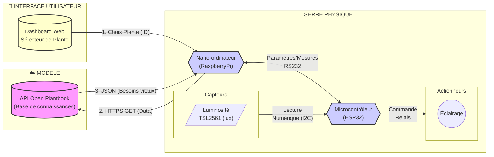

# 🌿 MINI PROJET 2026 : SERRE AUTONOME & ADAPTATIVE (AGRITECH)

## Activité n°4 (IR) : Finalisation des applications

### Mise en situation

Rappel : Le système doit maintenir un environnement idéal pour la croissance des plantes.

Le système est architecturé autour de deux unités centrales de traitement :

- [Raspberry Pi](https://fr.wikipedia.org/wiki/Raspberry_Pi) : un nano-ordinateur monocarte à processeur ARM
- [ESP32](https://fr.wikipedia.org/wiki/ESP32) : un microcontrôleur basé sur l'architecture Xtensa (double coeur) et microprocesseur LX de Tensilica

Missions du système :

- L'utilisateur indique sa culture via une interface web.

- Le nano-ordinateur Raspberry Pi interroge l'API _Open Plantbook_ pour récupérer les besoins vitaux de la plante.

- Le nano-ordinateur Raspberry Pi transmet les besoins vitaux de la plante au microcontrôleur ESP32

- Le microcontrôleur ESP32 paramètre automatiquement les seuils des capteurs (Sol, Air, Lumière) et des actionneurs sans intervention humaine.

- Le microcontrôleur ESP32 lit périodiquement les capteurs (Sol, Air, Lumière).

- Le microcontrôleur ESP32 commande les actionneurs suivant les seuils paramétrés.

- Le microcontrôleur ESP32 transmet périodiquement les mesures relevées au nano-ordinateur Raspberry Pi.

Synoptique partiel du système :



### Travail demandé

Le système est piloté par trois applications à finaliser pour assurer une démonstration du fonctionnement :

- Raspberry Pi : [README.md](../src/raspberry-pi/README.md)
- ESP32 : [README.md](../src/esp32/README.md)

> Les codes sources des différentes applications sont situés à la racine du dépôt dans le répertoire [src](../src/).

1. Intégrer les fonctionnalités réalisées pendant les activités précédentes dans :

- [app_web.py](../src/raspberry-pi/app_web.py)
- [reception_mesures.py](../src/raspberry-pi/reception_mesures.py)
- [main.cpp](../src/esp32/src/main.cpp)

2. Assurer un contrôle de l'éclairage pour la plante sélectionnée. La commande de l'éclairage sera visualisée par une Led reliée à l'ESP32 :

- Led allumée : éclairage activé
- Led éteinte : éclairage désactivé

3. Mise en oeuvre du Raspberry Pi 5

Les commandes :

- Identification du processeur

```sh
$ cat /proc/cpuinfo

```

- Identification de la mémoire RAM

```sh
$ free -h

```

- Identification de la version du noyau

```sh
$ uname -a

```

- Identification de la distribution

```sh
$ cat /etc/os-release

```

- Identification des systèmes de fichiers :

```sh
$ df -h

```

- Installation Python (si besoin) :

```sh
$ sudo apt update
$ sudo apt install python3 python3-pip
```

- Version Python :

```sh
$ python --version

```

- Installation des modules pour les applications Python :

```sh
$ pip install -r requirements.txt
```

Compléter le tableau ci-dessous :

| Information      | Valeur |
| ---------------- | :----: |
| Modèle           |        |
| Processeur       |        |
| Fréquence        |        |
| Nombre de coeurs |        |
| Mémoire          |        |
| Version noyau    |        |
| Distribution     |        |
| Version Python   |        |
| Espace disque    |        |

### Bonus

- Lecture entrée analogique (CTN, ...)
- Lecteur entrée numérique : (on/off, manu/auto, ...)
- Visualisation des autres actionneurs

---
BTS LaSalle Avignon 2026
