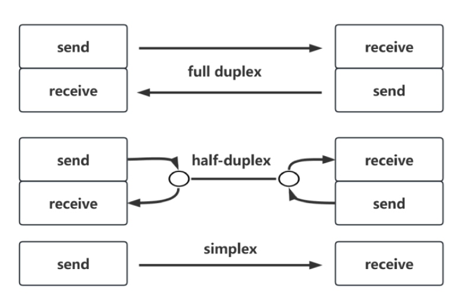
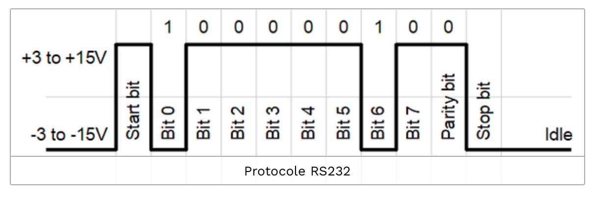
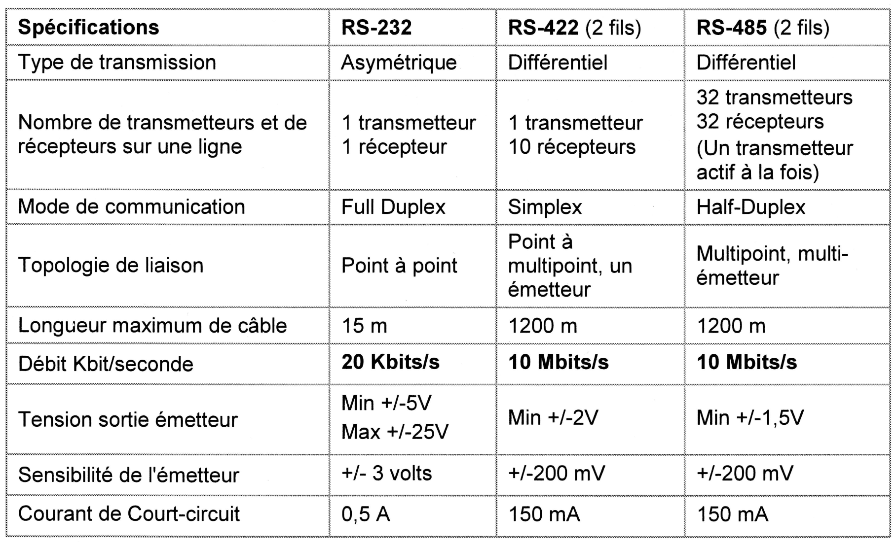
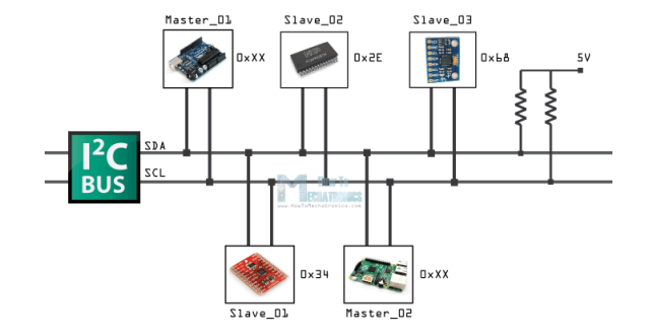

# TRANSMISSION DE DONNEES

## Comment peut-on transmettre des données ?

> - **En parallèle** : Tous les bits du message sont transmis en parallèle (tous en même temps). Un dispositif de contrôle permet la sélection du destinataire du message et l'envoi des données. 
> - **En série** : Pour limiter le nombre de fils, on transmet les bits de données sur un fil les uns après les autres dans le temps.

**Cette transmission sérielle est donc plus simple mais elle est moins rapide que la transmission en parallèle qui transmet tous les bits en même temps.**

## Quels sont les modes de transmission ?

Pour une transmission donnée sur une voie de communication entre deux machines, la communication s'effectue en série. Les données et le contrôle sont envoyés les uns après les autres.

Les modes de transmission en série peuvent être de 3 types :

> - **_full-duplex_** : caractérise une liaison dans laquelle les données circulent de façon bidirectionnelle et simultanément. Ainsi, chaque extrémité de la ligne peut émettre et recevoir en même temps.
> - **_half-duplex_** : caractérise une liaison dans laquelle les données circulent dans un sens ou l' autre, mais pas les deux simultanément. 
> - **_simplex_** : caractérise une liaison dans laquelle les données circulent dans un seul sens, c'est-à-dire de l'émetteur vers le récepteur. (par exemple de votre ordinateur vers l'imprimante ou de la souris vers l'ordinateur). 

## Quels sont les types de synchronisation entre l'émetteur et le récepteur ?

2 types :

> - **Synchrone** : l'horloge est transmise entre l'émetteur et le récepteur. Un fil d'horloge ou des éléments d'horloge (front montant ou descendant) sont ajoutés aux données transmises. 
> - **Asynchrone** : l'horloge n'est pas transmise. L’émetteur et le récepteur ont une horloge de même valeur mais il n’y a pas de fil d’horloge. Le récepteur synchronise son horloge à partir de bits transmis au début (notion de _start_).

## Quel est l'unité de la vitesse de transmission ?

Le **débit** ou vitesse de transmission des informations s’exprime en :

> - le **baud** est l'unité de mesure de la rapidité de modulation (nombre de symboles élémentaires transmis en 1 seconde) dans le cas d'un signal modulé. 
> - le **bit/s** (ou bit par seconde ou bps) est l'unité de mesure du nombre d'informations effectivement transmises par seconde.

:warning: Il est possible de transmettre plusieurs bits par symbole. En transmission numérique, on prendra généralement 1 baud = 1 bit/s.

Une caractéristique essentielle de la transmission est sa fréquence d’horloge, laquelle définit la durée de l’intervalle imparti à chacun des bits (_nominal bit time_).

**Temps de transmission d’un bit : $T_{\text{émission}} =  \frac{1}{Débit}$**

## Qu'est-ce qu'un protocole de transmission de données ?

> C’est la façon dont les informations sont transmises pour composer un message complet.

Le protocole peut être réalisé de façon matérielle (_hardware_) et/ou logicielle (_software_).

De façon à assurer une transmission, il est nécessaire d'ajouter d’autres bits :

- Bit de départ (start) : indique le début de la transmission (permet la synchronisation du récepteur).
- Bit de parité : pour contrôler l’intégrité des données (permet la détection des erreurs de transmission).
- Bits de stop : indique la fin de la transmission (permet de placer la ligne au repos).

Le standard RS-232 permet une communication **série, asynchrone et duplex** entre les deux équipements sur trois fils minimum.

Exemple de trame RS-232 :

Les bits sont envoyés du LSB (_Least Significant Bit_) vers le MSB (_Most Significant Bit_).

Les débits utilisés en pratique varient entre 75 bit/s et 115 200 bit/s. Les débits les plus répandus sont 9600 bits/s (RS-232) et 115200 bits/s (RS-232 TTL courte distance).

Configuration d'une trame RS-232 (couche Physique) :

- 1 bit de départ ('START')
- 7 à 8 bit de données
- 1 bit de parité optionnel (aucune, paire ou impaire)
- 1 ou plusieurs bits d’arrêt ('STOP')

## Quels sont les niveaux de tension utilisés sur une liaison RS232 ?
> Un niveau logique "0" est représenté par une tension de +3 V à +25 V et un niveau logique "1" par une tension de −3 V à −25 V (avec un [codage NRZ](https://fr.wikipedia.org/wiki/Non_Return_to_Zero) pour _non-return-to-zero_).

On utilise généralement le circuit [MAX232](https://www.ti.com/product/MAX232) pour mettre en forme des signaux conformes au standard RS-232.

Sinon, on peut transmettre, sur une courte distance, les bits avec les niveaux de tension [TTL](https://fr.wikipedia.org/wiki/Transistor-Transistor_logic) (0V - 5V ou 3,3V).

## Est-ce que le standard RS-232 est encore utilisé aujourd'hui ?

Disponible sur presque tous les PC depuis 1981 jusqu’au milieu des années 2000, il est communément appelé le « **port série** ».

La liaison série asynchrone RS232 n'est pratiquement plus utilisé comme moyen de communication entre PC.

Par contre, elle reste encore très présente dans les **systèmes industriels**, les **systèmes embarqués** (pour interfacer par exemple des modules de communication comme le Bluetooth, Zigbee, GPS, etc.) et les **systèmes réseaux** (pour administrer des équipements comme les _switchs_ et les routeurs).

Comme les PC ne disposent plus de port série matériel, il est possible d'utiliser des **ports séries virtuels** avec des [adaptateurs USB / RS-232](./Adaptateur-USB-RS232.md).

La liaison RS-485 est encore très présente dans les **systèmes industriels**.

## Quelles sont les caractéristiques des différentes liaisons séries ?

## Qu'est ce que le protocole I2C ?

Le bus de communication I2C (_Inter-Integrated Circuit_) est un bus informatique conçu par Philips pour les applications de domotique et d’électronique domestique, il permet de relier un microprocesseur (ou microcontrôleur) à différents circuits.

C’est une liaison série **synchrone bidirectionnel half-duplex** , où plusieurs équipements, maîtres ou esclaves, peuvent être connectés au bus.

La connexion est réalisée par l'intermédiaire de deux lignes :

> -	SDA (_Serial Data Line_) : ligne de données bidirectionnelle
>
> -	SCL (_Serial Clock Line_) : ligne d'horloge de synchronisation contrôlée par le maître (bidirectionnelle en multi-maîtres)
>
> Remarque : la masse qui doit être commune aux équipements.

Les échanges ont toujours lieu entre un seul maître et un (ou tous les) esclave(s), toujours à l'initiative du maître (jamais de maître à maître ou d'esclave à esclave).

Les caractéristiques électriques sont :

| Paramètres                |             Valeurs              |
| ------------------------- | :------------------------------: |
| Tension de bus            |              5 Vcc               |
| Niveau logique bas        |             3 à 5 V              |
| Niveau logique haut       |            0 à 1,5 V             |
| Distance de communication | Quelques dizaines de centimètres |

## Quel est le protocole de transmission utilisé sur le bus I2C ?

- LA CONDITION DE REPOS : _SDA_ et _SCL_ à `1`

> Lorsque le bus est libre (aucun composant ne communique), _SDA_ et _SCL_ sont à `1`.

- PRISE DE CONTROLE DU BUS PAR UN MAITRE : _SDA_ passe à `0` alors que _SCL_ reste à `1`

> Un maître prend le contrôle du bus en effectuant un START : il met _SDA_ à `0`, _SCL_ restant à `1`. Au cours de la communication, l’horloge _SCL_ est envoyée par le maître et _SDA_ ne peut changer d’état que lorsque SCL est à `0`. 
> 

- FIN DE COMMUNICATION ET LIBERATION DU BUS : _SDA_ passe à `1` alors que _SCL_ reste à `1`

> En fin de communication,le maître effectue un STOP : il met d’abord _SCL_ à `1` puis ramène _SDA_ à `1`. C’est le changement d’état de SDA alors que SCL est à `1` qui met fin à la communication. 
> 

- L'ACQUITTEMENT :

> Une fois les données transmises, un acquittement est opéré par celui qui reçoit les données. Cette procédure est réalisée en fin de trame de transmission.
> Le récepteur maintient la ligne SDA au niveau bas pendant le front d'horloge.

Exemple de trame I2C :

Voir aussi : [BUS-I2C.md](./BUS-I2C.md)

---
BTS LaSalle Avignon 2026
