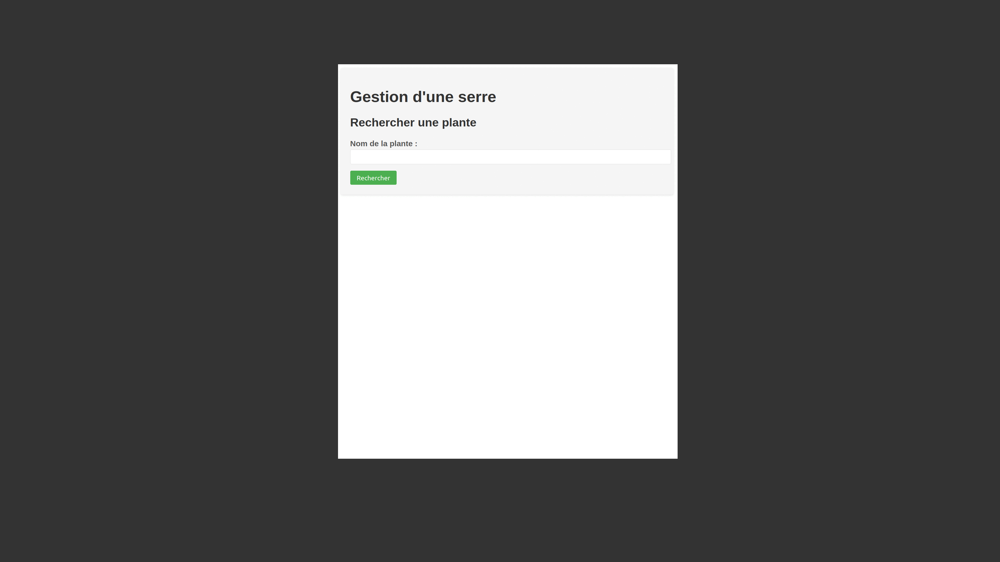
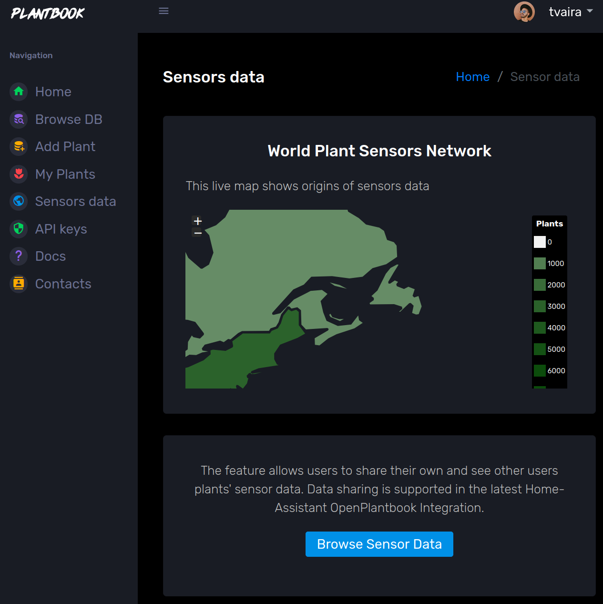
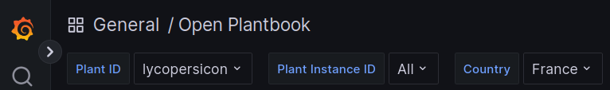
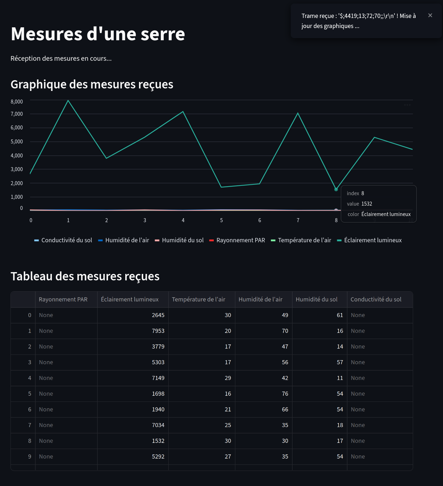
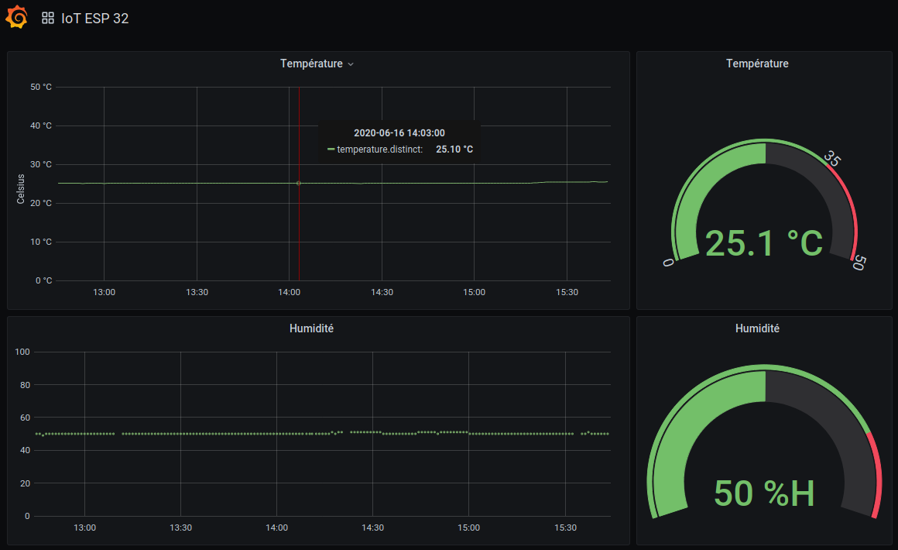

# 🌿 MINI PROJET 2026 : SERRE AUTONOME & ADAPTATIVE (AGRITECH)

## Application Web (Flask)

Code source : [app_web.py](./app_web.py)

Le script charge des paramètres qui doivent être définis dans un fichier `.env` situé dans le même répertoire que l'application :

```sh
$ touch .env
$ vim .env
```

Ce fichier doit contenir les variables d'environnement suivantes :

```txt
# --- Configuration API Open Plantbook ---
API_URL = "https://open.plantbook.io/api/v1"
# OAuth2 Client Credentials (token temporaire)
CLIENT_ID = 'xxxxxxxxxxxxxxx'
SECRET = 'yyyyyyyyyyyyyyyyyyyyyyy'
```

Démarrage de l'application web :

- Solution n°1 :

```sh
$ flask --app ./app_web.py run --debug
```

- Solution n°2 :

```sh
$ python3 ./app_web.py
```

- Solution n°3 : [gunicorn](https://flask.palletsprojects.com/en/stable/deploying/gunicorn/)

```sh
$ gunicorn -w 4 -b 127.0.0.1:5000 app_web:app
```

Pour un accès externe :

```sh
$ gunicorn -w 4 -b 0.0.0.0:5000 app_web:app
```

> :warning: Dans ce cas, il faut utiliser l'adresse IP de la machine (`ip address show`) dans l'URL (`http://<adresse_ip>:5000/`) car l'adresse `0.0.0.0` n'est évidemment pas une adresse valide. Pour fixer un numéro de port inférieur à 1024, il faudrait utiliser un _proxy_ inverse, tel que nginx ou Apache httpd, mais ne surtout pas exécuter l'application avec les droits `root` pour des raisons de sécurité.



## Réception des mesures (port série)

Code source : [reception_mesures.py](./reception_mesures.py)

Le script charge des paramètres qui doivent être définis dans un fichier `.env` situé dans le même répertoire :

```sh
$ touch .env
$ vim .env
```

Ce fichier doit contenir les variables d'environnement suivantes :

```txt
# --- Configuration du port série ---
NOM_PORT = '/dev/ttyUSB0'
DEBIT = 9600
```

Démarrage de la réception des mesures :

```sh
$ python3 ./reception_mesures.py
```

## Affichage des mesures

Pour obtenir de manière simple un tableau de bord (_dashboard_) des mesures de la serre :

- Solution n°1 : [Open Plantbook](https://open.plantbook.io/)

> [Open Plantbook](https://open.plantbook.io/) permet d'enregistrer les mesures en provenance des capteurs en utilisant l'API [Sensor-data](https://documenter.getpostman.com/view/12627470/TVsxBRjD). Il faut tout d'abord enregistrer la localisation de la culture de sa "plante" ([Plant-Instance Register](https://documenter.getpostman.com/view/12627470/TVsxBRjD#7ece7402-3c6f-4ed3-851e-9128c1726935)) puis transférer les mesures des capteurs des plantes à l'aide du protocole [JSON-time-series (JTS)](https://docs.eagle.io/en/latest/reference/historic/jts.html) ([Plant-data Upload](https://documenter.getpostman.com/view/12627470/TVsxBRjD#5059cef1-8ddf-4e84-a637-6fdf138ef483)).



La visualisation des mesures des capteurs est accessible depuis [Grafana](https://open.plantbook.io/grafana/?orgId=1) :



- Solution n°2 : [Streamlit](https://streamlit.io/)

> [Streamlit](https://streamlit.io/) permet de transformer un script Python de traitement de données en application Web sans investir trop de temps dans le _front-end_. Il existe aussi [PyGWalker](https://github.com/Kanaries/pygwalker).

Pré-requis : `pip install streamlit`

Code source : [afficher_mesures_streamlit.py](./afficher_mesures_streamlit.py)

```sh
$ streamlit run afficher_mesures_streamlit.py
```



- Solution n°3 : [Node-RED](https://nodered.org/)

> [Node-RED](https://nodered.org/) est un outil de programmation graphique (_Low-code_) par assemblage de nodes (blocs fonctionnels). Il est notamment utiliser pour développer des applications de l’Internet des Objets (IoT).

Tutoriel : [http://tvaira.free.fr/node-red/node-red.html](http://tvaira.free.fr/node-red/node-red.html)

- Solution n°4 : [Grafana](https://grafana.com/)

> [Grafana](https://grafana.com/) est un logiciel libre qui permet la visualisation de données. Il permet de réaliser des tableaux de bord et des graphiques depuis plusieurs sources dont des bases de données temporelles comme [InfluxDB](https://www.influxdata.com/products/influxdb-overview/).

Exemple :



---
BTS LaSalle Avignon 2026
